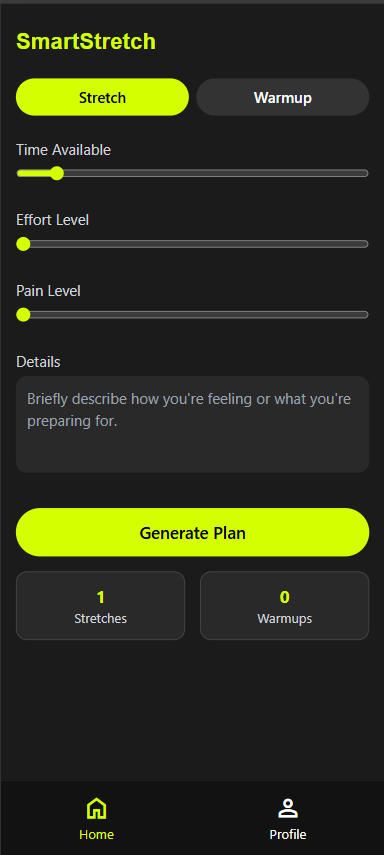
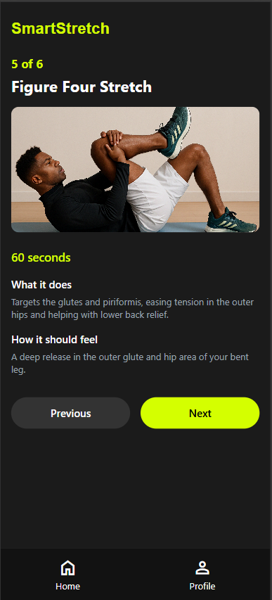
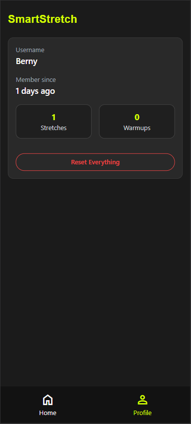

# StretchSmart

StretchSmart is a personalized stretch and warm-up recommendation app for runners.  
It uses AI (Gemini) to generate custom routines based on your time, effort, and recovery needs.

---

## Features

- Personalized stretching and warm-up routines
- AI-powered session generation using Gemini API
- Session tracking with progress stats
- Clean and responsive EJS frontend (Tailwind-based)
- JSON-based stat persistence (no database required)
- Reset progress anytime with a confirmation popup

---
## Pages Overview

### Home Page
Shows the main generator interface where users can choose Stretch or Warmup, adjust sliders, and enter custom details.



---

### Stretch/Warmup Plan Page
Displays the generated routine with step-by-step navigation, images, and explanations.



---

### Profile Page
Shows session stats, member info, and a reset button with confirmation.



---

## Tech Stack

- Node.js + Express
- EJS templating engine
- Tailwind CSS (via CDN)
- Google Gemini API (v1beta)
- File-based storage (`stats.json`, `stretchData.json`, etc.)

---

## Installation

```bash
git clone https://github.com/berny-ft/StretchSmart.git
cd StretchSmart
npm install
```
